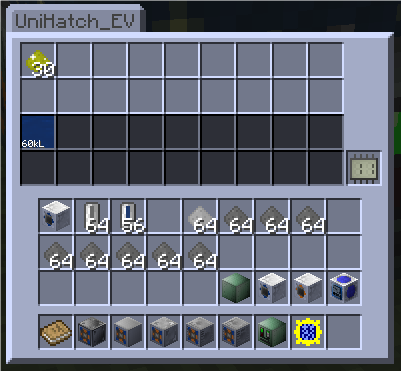
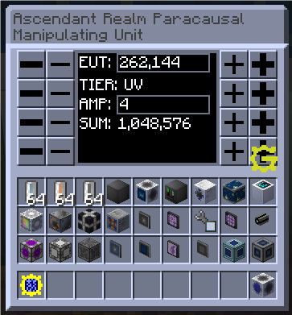
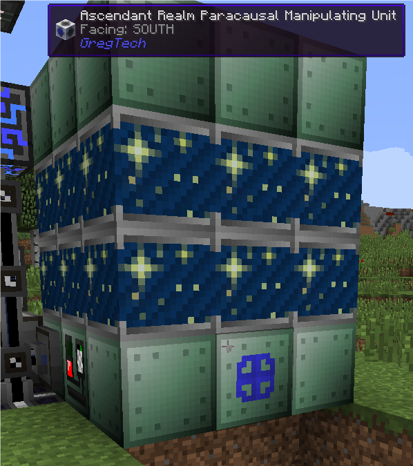

# GT Novelty

Novelty, a sort of mass-produced trinkets.

Currently, Novelty is still gathering thoughts about tiny things on GregTech. When it gets enough stuff, it will be
officially published to Curse or Modrinth.

## The Novelties

### UniHatch

A combination of Input Bus and Output Bus with all five tiers.

It works with Dual Interfaces from AE2FC, which it can push both Items and Fluids into UniHatch for automated crafting.

|   Tier | Item Slots | Fluid Slots | Fluid Amount |
|-------:|-----------:|------------:|-------------:|
| ULV(0) |          1 |           1 |      8,000 L |
|  LV(1) |          2 |           2 |     16,000 L |
|  MV(2) |          6 |           3 |     64,000 L |
|  HV(3) |          8 |           8 |    128,000 L |
|  EV(4) |         18 |          18 |  1,024,000 L |

### Ascendant Realm Paracausal Manipulating Unit

Other Pictures

A debug Energy Hatch with a super cool name. You can customize its output Voltage and Amperage in its GUI.

*Credit: The GUI is completely copied from Debug Power Generator from TecTech, under LGPLv3.*
